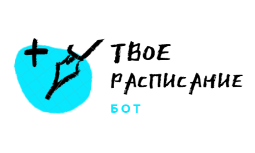

<h1>Бот "Твое расписание"</h1>
Проект создан для облегчения поиска и просмотра расписания студентов института ИТ, обучающихся на 2 курсе бакалавриата, а также для удобного просмотра погоды в Москве.
VK_BOT представляет собой бота в социальной сети ВКонтакте, обладает удобным и понятным функционалом. 
Пользователь может узнать расписание на сегодня, завтра, на текущую или следующую неделю для своей группы. А также иммет возможность узнать погоду на сегодня, завтра и на 5 дней.
  В зависимости проекта входят следующие библиотеки языка Python:
    <ul>
    <li>- <b>Pillow</b> - используется для обработки графики, в нашем проекте служит для отображения изображений с погодой</li>
    <li>- <b>xlrd</b> - используется для работы с файлами Excel, в нашем проекте служит для работы с таблицами расписаний</li>
    <li>- <b>bs4</b> - парсер для извлечения данных html и xml, в нашем проекте служит для извлечения файлов с расписанием с официального сайта РТУ МИРЭА</li>
    <li>- <b>vk_api</b> - модуль для создания скриптов для социальной сети ВКонтакте, с его помощью описывается интерфейс и функционал бота</li>
    </ul>

Команды для запуска проекта (нужно находиться в корневом каталоге проекта):
    
    docker build --tag python-docker .
    docker run -i -t python-docker
